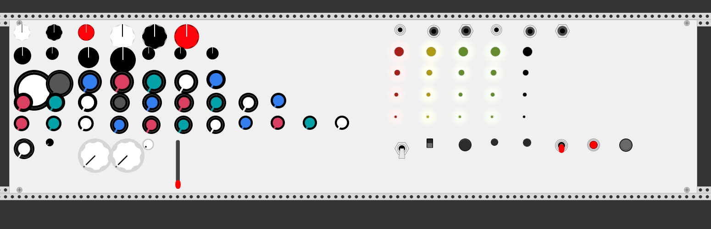

# vcv-ui-test

* UI demo plugin for VCV Rack v0.4.0 https://vcvrack.com/.
* Doesn't do audio.
* Simple plugin just for programmers to see and play all of the available UI controls in one place
* See [MyModule.cpp](src/MyModule.cpp#L103) for how to create UI element you want

## Screenshot

